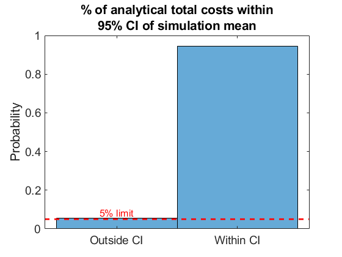

# Battery Dispatching for End Users With On-Site Renewables and Peak Demand Charges - An Approximate Dynamic Programming Approach
*Michael E. Cholette, Lei Liu, Babak Jeddi, and Yateendra Mishra*

The paper can be found [here](https://ieeexplore.ieee.org/abstract/document/9655264) and the accepted manuscript can be found [here](https://eprints.qut.edu.au/227233/). Alternatively, you may request a copy now emailing Michael E. Cholette at the email address provided for the corresponding author at the IEEE *Xplore* link provided.

## Summary
- The paper describes a new method to reduce the electricity bill of an end user (e.g. residential customer), which includes a peak demand charge (i.e. the maximum demand over the billing period)
- The state is augmented with the running peak demand, which makes the otherwise linear-gaussian dynamics nonlinear
- The demand is modelled with a Periodic Autoregressive (PAR) model, which accounts for variable autocorrelation and heteroskedasticity throughout the day.
- A new Approximate Dynamic Programming (ADP) method is developed that exploits some new analytical results to simplify the optimization and enable backward induction.
- The new method is used on a residential community case study in Queensland, Australia
- The new ADP method significantly outperforms lookup table and Model-Predictive Control (MPC) benchmarks. 

## Abstract
Battery energy storage systems (BESSs) have the potential to reduce end users’ electricity bills by shifting their grid demand in response to price incentives. Some electricity retailers charge end users for their peak demand in the billing cycle regardless of the time of occurrence. Yet, using BESSs to reduce demand charges is challenging, since the net demand of end users can be highly uncertain due to low aggregation and on-site renewable generation. In this article, an approximate dynamic programming (ADP) methodology is developed to control a BESS to minimize an end user’s electricity bill, which includes both an energy charge and monthly peak demand charge. To address time-varying uncertainty, the net demand is modeled using a periodic autoregressive (PAR) model, which is then used to formulate a Markov Decision Process whose objective is to minimize the sum of energy, peak demand, and battery usage costs. A backward ADP strategy is developed which is enabled by new closed-form expressions for the probability distribution of the expected stage and tail costs when a radial basis function (RBF) value function approximation (VFA) is employed. The approach is applied to real net demand data from a small Australian residential community and compared to two benchmark policies: a lookup table VFA and a model predictive control (MPC) approach. The results show that the proposed approach reduces the average monthly peak demand by about 25% (yielding an 8% reduction in the electricity bill), whereas the best-performing benchmark policy reduced the peak demand by about 17%.

## Source Code 
### Required Software and Toolboxes 
- MATLAB (code tested on R2020a, but should work on later versions as well)
- External Toolboxes: 
  - [regtools](http://www2.compute.dtu.dk/~pcha/Regutools/). MATLAB version available on the MATLAB Central File Exchange [here](https://www.mathworks.com/matlabcentral/fileexchange/52-regtools). This is needed for the backward ADP function. The version used in the code for the paper is provided in this repo under the *regtools* folder.
  - [CVX for MATLAB](http://cvxr.com/cvx/). The code for the paper used version 2.1. This is only needed for solving the perfect knowledge and MPC optimization problems.
  - [MOSEK](https://www.mosek.com/downloads/) (optional). Version 9.1 was used for the simulations in the paper. Again, this is only needed for solving the perfect knowledge and MPC optimization problems.
- MATLAB Toolboxes:
  - Parallel computing toolbox
  - MATLAB parallel server 

### Input data format, PAR modelling, and optimization problem setup
Unfortunately, the raw data cannot be provided due to confidentiality arrangements. However, the format is described here for completeness. The raw data was provided as a .xlsx file, whose first column contains datetime timestamps and whose second column contains the net demand in kW. These column indices are hard coded into `demand_model/importData` (perhaps not the best practice for generality, but this function was not intended to be general).

The Periodic Autoregressive (PAR) model parameters can be estimated by running the script `fit_demand_model` with the appropriate user parameters specified at the top of the script. This script should work for PAR($n_a$) models with $n_a\geq 1$, but subsequent functions assume $n_a=1$, since it was shown to be adequate for our case study. The model is saved as a .mat file. 

After running `fit_demand_model`, the script `load_optimization_parameters` should be run. This script loads the saved PAR model, sets the costs, sets the constraints, and builds the time-varing state-space matrices via a base model and the `utilities/buildSystemMatrices` function (note that this function only works for PAR(1)). This script fully specifies the optimization model in Eq. (7) in the paper and is saved as a .mat file. 

### Backward ADP with RBFs
This algorithm is the main result of the paper (Algorithm 1) and it is implemented in the function `rbfVFA/backwardADP`. Since there are a number of inputs to this function, it is easiest to call it by modifying and running the script `backwardADP_top` that has some notes on the parameter choices (more discussion on these choices can be found in the paper). The fully specified optimization problem is specified by the previously saved .mat file `optModel`.

Note that depending on the parameter values, this script may take some time to run. The backward ADP strategies in the paper took hours of training with 16 workers (i.e. on an HPC) and this depends strongly on the parameters in $nc$. Luckily, $nc=10$ produced reasonable results, and took about 3.3 hours to train for a 31-day month using 16 workers. If you are running this on a laptop, you are likely limited to fewer workers, so the training will take longer. You'll be able to estimate the time to finish based on the displayed output of the function.   

### Backward induction with a lookup table
The lookup table is implemented in the function `lookup_table/backwardDP_Lookup_PAR1`, which only works when the demand model is PAR(1). Again, the easiest way to run this is to use `backwardDP_Lookup_top` script, which has guidance on the selection of the parameters. 

There is a more general lookup table function that will work for higher-order PAR models, however it is much slower since it must use `mvncdf` to compte the state probabilities (this can be seen in the verification script mentioned below). Thus, `lookup_table/backwardDP_Lookup_PAR1` was used for the paper to provide a fair comparison with the RBF VFA approach.

## Verification of analytical expectations
The analytical expectations in the paper were verified using Monte Carlo simulations. 
### RBF VFA analytical expectation (Theorem 2)
The comparison of the Monte Carlo simulations and the results of Theorem 2 was conducted using the script `test_expected_stage_cost_and_tail_cost`. Here, the time index, state, and inputs were randomly sampled and the expectation was computed using the analytical formula and via sample averages of Monte Carlo simulations. 

An example result is shown for a trained RBF VFA with $M=1000$ from the paper. As expected, the analytical result is within the 95% confidence interval of the Monte Carlo simulation mean 95% of the time. 

### Lookup table analytical expectation (Eq. (32) in the paper)
For the lookup table implementation, the expectation in Eq. (32) was verified with Monte Carlo simulation via `test_lookup_expected_value`. Once again, the time index, state, and inputs were randomly samples and the expectation was computed via (32) and compared with the confidence interval of the Monte Carlo simulation mean. One can run this script a few times to assess the accuracy of the expected value computation as well as the two implementations of the expected value. One implementation uses MATLAB's `mvncdf` while the other implementation uses a stripped-down version of `normcdf` called `normcdf2`. Usually, `normcdf2` is much faster and produces the same result as `mvncdf` for PAR(1) models. 

## Citation
If you find this code useful in your research, please consider citing the paper. Suggested citations are provided below.

### Plain text
  M. E. Cholette, L. Liu, B. Jeddi and Y. Mishra, "Battery Dispatching for End Users With On-Site Renewables and Peak Demand Charges--An Approximate Dynamic Programming Approach," in *IEEE Transactions on Control Systems Technology*, doi: 10.1109/TCST.2021.3132662.

### BibTeX
  ~~~
  @ARTICLE{9655264,
    author={Cholette, M.E. and Liu, L. and Jeddi, B. and Mishra, Y.},
    journal={IEEE Transactions on Control Systems Technology}, 
    title={Battery Dispatching for End Users With On-Site Renewables and Peak Demand Charges--An Approximate Dynamic Programming Approach}, 
    year={2021},
    volume={},
    number={},
    pages={1-15},
    doi={10.1109/TCST.2021.3132662}}
  ~~~

